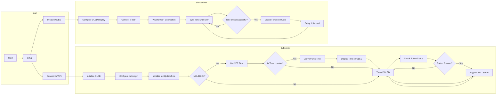

# esp8266 digital clock

## Program ini merupakan contoh sederhana tentang cara mengontrol OLED yang terpasang pada ESP8266 dengan menggunakan sebuah tombol. Program ini juga menampilkan waktu NTP pada OLED, yang diperbarui setiap 5 menit sekali.

### Untuk menjalankan program ini, Anda memerlukan:

* ESP8266 dengan OLED 0.96" terpasang
* Tombol
* Kabel jumper
* Perangkat untuk mengupload program ke ESP8266, seperti kabel USB-to-Serial atau modul ESP8266

Hubungkan OLED ke ESP8266 sesuai dengan petunjuk yang terdapat pada OLED. Hubungkan tombol ke ESP8266 dengan menghubungkan pin tombol ke salah satu pin digital ESP8266. Misalnya, jika Anda menghubungkan tombol ke pin D1, maka Anda perlu menambahkan const int buttonPin = D1; pada program. Hubungkan ESP8266 ke perangkat yang akan Anda gunakan untuk mengupload program.

Untuk menggunakan program ini, upload program ke ESP8266 menggunakan perangkat yang telah disiapkan. Buka serial monitor pada perangkat yang Anda gunakan untuk mengupload program. Tekan tombol untuk mematikan atau menyalakan OLED. Anda akan melihat waktu NTP yang diperbarui muncul pada OLED setiap 5 menit sekali jika OLED menyala.

Pastikan untuk mengubah konstanta SSID dan PASSWORD sesuai dengan nama jaringan WiFi dan password yang Anda gunakan. Jika Anda menggunakan pin digital yang berbeda dari D1 untuk menghubungkan tombol, pastikan untuk mengubah konstanta buttonPin sesuai dengan pin yang Anda gunakan.

## Flowchart

