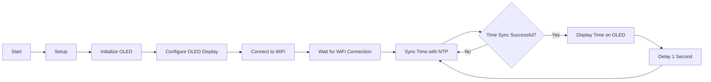

# Memperbarui dan Menampilkan Waktu NTP pada OLED pada ESP8266
Program ini merupakan contoh sederhana tentang cara memperbarui dan menampilkan waktu NTP pada OLED pada ESP8266. Program ini juga menunjukkan cara mengkonversi waktu Unix ke dalam format tanggal dan waktu yang mudah dibaca oleh manusia.

## Persiapan
Untuk menjalankan program ini, Anda memerlukan:

* ESP8266 dengan OLED 0.96" terpasang
* Kabel jumper
* Perangkat untuk mengupload program ke ESP8266, seperti kabel USB-to-Serial atau modul ESP8266

## Koneksi Fisik
* Hubungkan OLED ke ESP8266 sesuai dengan petunjuk yang terdapat pada OLED.
* Hubungkan ESP8266 ke perangkat yang akan Anda gunakan untuk mengupload program.

## Cara Menggunakan
1. Upload program ke ESP8266 menggunakan perangkat yang telah disiapkan.
2. Buka serial monitor pada perangkat yang Anda gunakan untuk mengupload program.
3. Program akan secara otomatis memperbarui waktu NTP setiap 5 menit sekali, dan menampilkan waktu tersebut pada OLED.

## Flowchart

## Catatan
Pastikan Anda mengubah konstanta SSID dan PASSWORD sesuai dengan nama jaringan WiFi dan password yang Anda gunakan.
Format tanggal dan waktu yang ditampilkan pada OLED dapat diubah dengan mengubah parameter yang diberikan ke fungsi strftime(). Sebagai contoh, untuk menampilkan tanggal dalam format YYYY-MM-DD, ubah "%d-%m-%Y" menjadi "%Y-%m-%d".
